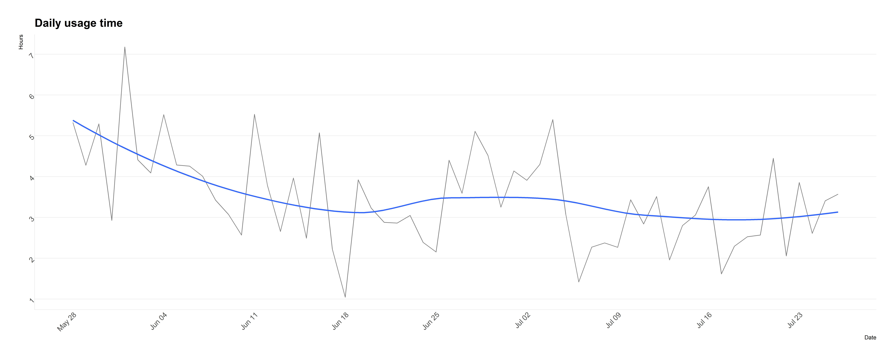

<div align="right">
### Monthly app report
#### `r format(Sys.Date(), "%B %d, %Y")`
</div>
```{r setup, include=FALSE}
knitr::opts_chunk$set(echo=FALSE, message=FALSE, strip.white=TRUE)

library(tidyverse)
library(lubridate)
library(cowplot)
library(hrbrthemes)
library(scales)
library(directlabels)

# Functions
source("load_data.R")
source("no_clip.R")

options(warn=-1)
```

```{r cleaning, include=FALSE} 
logs <- load_data()

cleaned <- logs %>% 
  mutate_if(is.numeric, as_datetime) %>% 
  select(app_name, everything()) %>% 
  mutate(duration = final_time - initial_time) %>% 
  filter_at(vars(one_of("app_name")), any_vars(!str_detect(., "%WIN"))) %>% 
  filter_at(vars(one_of("app_name")), any_vars(!str_detect(., "Notification"))) %>% 
  filter_at(vars(one_of("app_name")), any_vars(!str_detect(., "%WIN"))) %>% 
  filter_at(vars(one_of("app_name")), any_vars(!str_detect(., "Photos"))) %>% 
  filter_at(vars(one_of("app_name")), any_vars(!str_detect(., "Select"))) %>% 
  filter_at(vars(one_of("app_name")), any_vars(!str_detect(., "Filters"))) %>% 
  filter_at(vars(one_of("app_name")), any_vars(!str_detect(., "Home"))) %>% 
  filter_at(vars(one_of("app_name")), any_vars(!str_detect(., "Album"))) %>% 
  filter_at(vars(one_of("app_name")), any_vars(!str_detect(., "Post"))) %>% 
  filter_at(vars(one_of("app_name")), any_vars(!str_detect(., "Apps"))) %>% 
  filter_at(vars(one_of("app_name")), any_vars(!str_detect(., "Battery"))) %>% 
  filter_at(vars(one_of("app_name")), any_vars(!str_detect(., "Reply"))) %>% 
  filter_at(vars(one_of("app_name")), any_vars(!str_detect(., "Subreddit"))) %>% 
  filter_at(vars(one_of("app_name")), any_vars(!str_detect(., "info"))) %>% 
  filter_at(vars(one_of("app_name")), any_vars(!str_detect(., "Month"))) %>% 
  filter_at(vars(one_of("app_name")), any_vars(!str_detect(., "Camera"))) %>% 
  filter(duration != 82078) # Error: 23 hrs of TickTick

```

```{r top10vars, include=FALSE}
top10 <- cleaned %>% 
  group_by(app_name) %>% 
  summarize(total_dur = sum(duration)) %>% 
  arrange(desc(total_dur)) %>% 
  head(10) %>% 
  pull(app_name)

top10_30days <- cleaned %>% 
  filter(initial_time > today() - 30) %>% 
  group_by(app_name) %>% 
  summarize(total_dur = sum(duration) / 60) %>% 
  arrange(desc(total_dur)) %>% 
  head(10) %>% 
  pull(app_name)

newapps <- setdiff(top10, top10_30days)
```

```{r viz, fig.height=8, fig.width=20}
#Total usage in hours per day
plot.saved1 <- cleaned %>%
  group_by(byday = floor_date(initial_time, "day")) %>%
  summarize(total_dur = sum(duration)) %>%
  filter(byday != today()) %>% 
  ggplot(aes(x = byday, y = total_dur / 3600)) + 
  geom_path(color = "Grey50") + 
  geom_smooth(se = FALSE) + 
  theme_ipsum(grid = "Y", axis = "xy") + 
  scale_x_datetime(date_breaks = "1 week", date_labels = "%b %d") +
  scale_y_continuous(breaks = 1:10) +
  labs(title = "Daily usage time",
       x = "Date", y = "Hours") + 
  theme(axis.text = element_text(angle = 45, hjust = 1))

ggsave("plot1.jpeg", plot = plot.saved1, dpi = 500)
```


`r paste0("New apps out of top 10: ", setdiff(top10, top10_30days))`


```{r plots, fig.width=20, fig.height=20, include=FALSE}
# Total usage in minutes for top 10 apps all time
plot.alltime <- cleaned %>%
  filter(app_name %in% top10) %>% 
  group_by(app_name, byday = floor_date(initial_time, "day")) %>%
  summarize(total_dur = sum(duration) / 3600) %>%
  filter(byday != today()) %>% 
  ggplot(aes(x = byday, y = total_dur, color = app_name)) + 
  geom_smooth(se = FALSE) + 
  geom_dl(aes(label = app_name),
          method = list(cex = 0.8, "last.bumpup")) +
  guides(color = FALSE) +
  theme(plot.margin = unit(c(.9, 2.5, 1, 1.2), "cm")) +
  theme_ipsum(grid = "Y", axis = "xy") +
  labs(title = "All time usage of Top 10 Apps",
       x = "Date", y = "Hours")

plot.alltime <- no_clip(plot.alltime)

# Total usage in minutes for top 10 apps (past 30 days)
plot.30days <- cleaned %>%
  filter(app_name %in% top10) %>%
  filter(initial_time > today() - 31) %>% 
  group_by(app_name, byday = floor_date(initial_time, "day")) %>%
  summarize(total_dur = sum(duration) / 3600) %>%
  filter(byday != today()) %>% 
  ggplot(aes(x = byday, y = total_dur, color = app_name)) + 
  geom_smooth(se = FALSE) + 
  geom_dl(aes(label = app_name),
          method = list(cex = 0.8, "last.bumpup", vjust = 2)) +
  guides(color = FALSE) +
  theme(plot.margin = unit(c(.9, 2.5, 1, 1.2), "cm")) +
  theme_ipsum(grid = "Y", axis = "xy") + 
  labs(title = "Usage of Top 10 Apps for the past 30 days",
       x = "Date", y = "Hours") 

plot.30days <- no_clip(plot.30days)

# Mean usage time in seconds for all apps
plot.mean.usage <- cleaned %>%
  group_by(byday = floor_date(initial_time, "day")) %>%
  summarize(mean_dur = mean(duration)) %>%
  filter(byday != today()) %>% 
  ggplot(aes(x = byday, y = mean_dur)) + 
  geom_path(color = "Grey50") + 
  geom_smooth(se = FALSE) + 
  theme_ipsum(grid = "Y", axis = "xy") + 
  labs(title = "Average time apps are opened",
       x = "Date", y = "Seconds") 

# Mean usage time by app
plot.mean.usageapp <- cleaned %>%
  group_by(byday = floor_date(initial_time, "day"), app_name) %>%
  summarize(mean_dur = mean(duration)) %>%
  filter(byday != today()) %>% 
  filter(app_name %in% top10) %>%
  ggplot(aes(x = byday, y = mean_dur, color = app_name)) + 
  geom_smooth(se = FALSE) + 
  coord_cartesian(ylim = c(0,450)) +
  geom_dl(aes(label = app_name),
          method = list(cex = 0.8, "last.bumpup")) +
  guides(color = FALSE) +
  theme(plot.margin = unit(c(.9, 2.5, 1, 1.2), "cm")) +
  theme_ipsum(grid = "Y", axis = "xy") + 
  labs(title = "Average time Top 10 Apps are opened",
       x = "Date", y = "Seconds") 
  

plot.mean.usageapp <- no_clip(plot.mean.usageapp)

plot.saved2 <- plot_grid(plot.alltime, plot.30days, plot.mean.usage, 
                        plot.mean.usageapp, ncol = 2)

ggsave("plot2.jpeg", plot = plot.saved2, dpi = 500)
```

